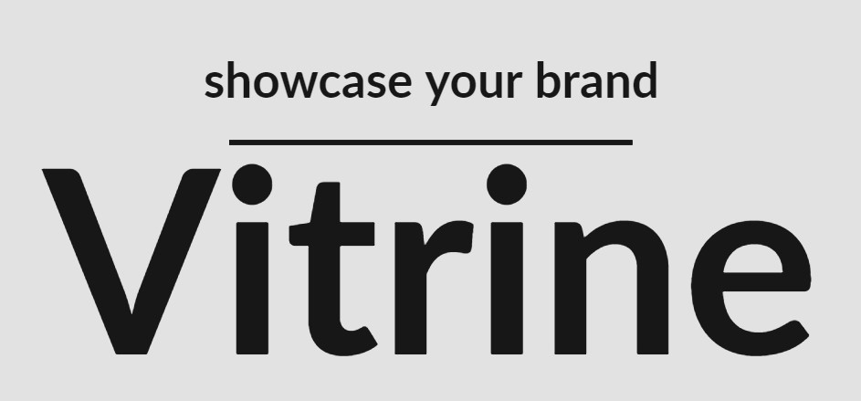
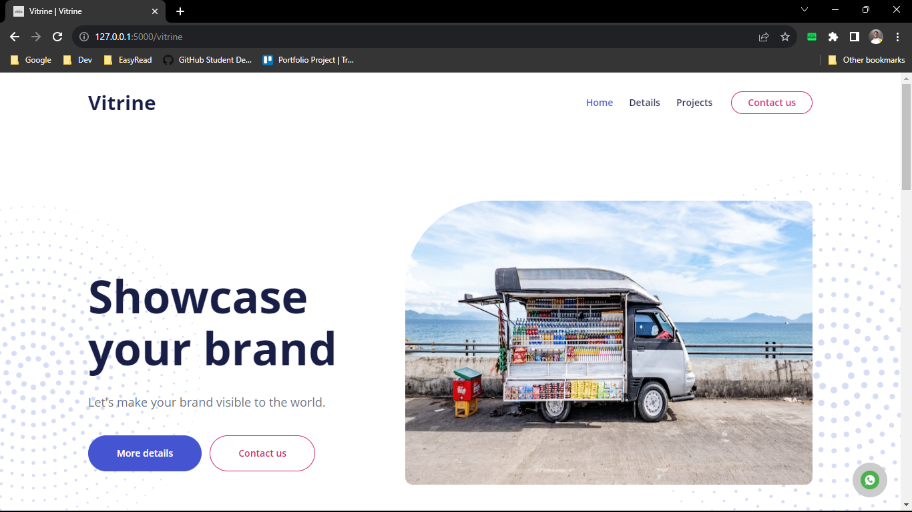
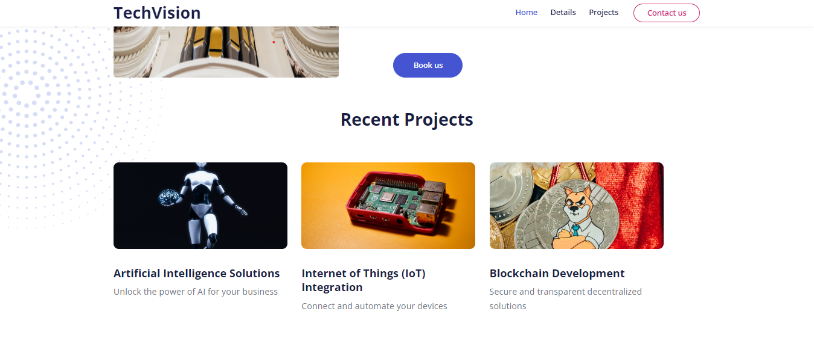
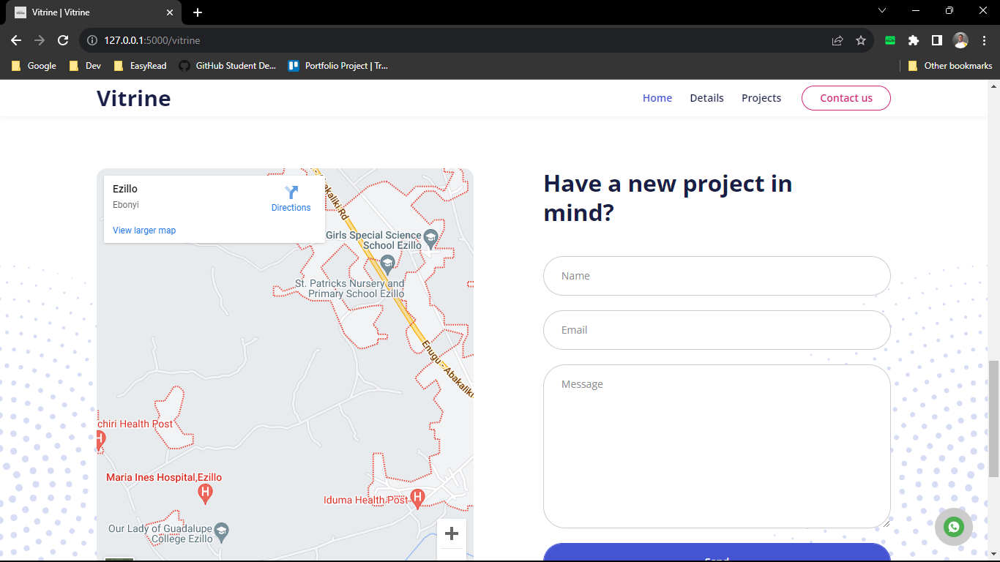
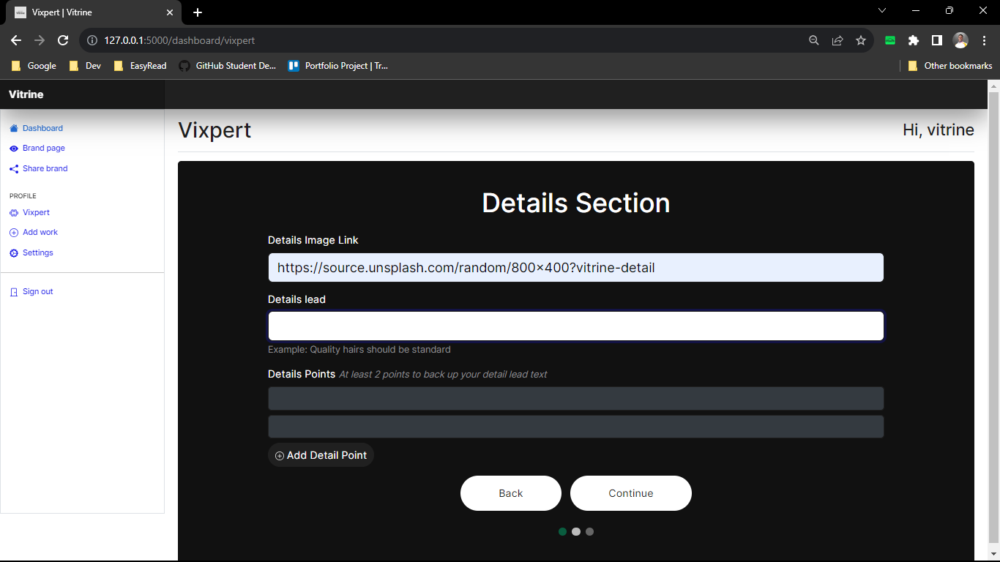

# Vitrine

[](https://github.com/Naereen/badges/)


Vitrine is a web application that helps people portray their businesses online. Just like the tagline **Showcase your brand**, this project is envisioned to help people showcase their brand.

<!-- Visit the [website](https://vitrine.me). -->

[](https://www.python.org/)



## Table of content

- [Overview](#vitrine)
- [The Story](#the-story)
- [Features](#features)
- [Demo](#demo)
- [Getting Started](#getting-started)
  - [Launch the API](#launch-the-api-first)
  - [Launch the web app](#launch-the-web-app)
- [Testing](#testing)
- [API](#api)
- [Dependencies](#dependencies)
- [Contributing](#contributing)
- [Author](#author)
- [Acknowledgements](#acknowledgements)
- [License](#license)

## The Story

I met a woman at the ATM stand and she was complaining that of how complex Facebook Business Suite is and that she needed a simple way to present her business online. She went further to tell me about how she lost jobs because she didn't have an online presence for her "small brand". I asked her what kind of platform would you like to use. She said something simple, she just wanted to present her business, what it is about and dispay few of her recent projects. I went further to ask my peers who were into online business and some other business people and they complained that the existing services require a lot of verification and upload and you can't just reuse a link from your cloud storage or somewhere. After thinking about all these, I decided to come up with an idea of a web application that can solve their problem. With simplicity in mind, I embarked on this project and thus, Vitrine was born.

I used a Kanban board on Trello to keep track of tasks in order to be able to follow my plan through. Gradually, I completed the checklist on each card and moved them to the next list.

- [Trello Kanban Board](https://trello.com/b/17TmBcq8/portfolio-project)
<!-- - [Blog Post]() -->

## Features

- Brand Page

  

- Recent Works

  

- Contact

  

- Vixpert Wizard

  

## Demo

[](https://youtu.be/NoJ74GNxGos)

## Getting Started

<!-- You can easily access it from our website: https://vitrine.me -->

- ### Launch the API first

  1. Create database and user

  ```bash
  mysql -uroot -p < setup_mysql_dev.sql
  ```

  2. **[Optional]** Seed db with dummy data

  ```bash
  VIT_ENV=dev VIT_MYSQL_USER=vit_dev VIT_MYSQL_PWD=vit_dev_pwd VIT_MYSQL_DB=vit_db VIT_MYSQL_HOST=localhost python3 feed_db.py
  ```

  3. Start the API

  ```
  VIT_ENV=dev VIT_MYSQL_USER=vit_dev VIT_MYSQL_PWD=vit_dev_pwd VIT_MYSQL_DB=vit_db VIT_MYSQL_HOST=localhost VIT_API_HOST=0.0.0.0 VIT_API_PORT=5001 VIT_MAIL_SENDER=<email> VIT_MAIL_PASSWORD=<mail_password> python3 -m api.v1.app
  ```

- ### Launch the web app

  _Optional: VIT_API_URL_

  ```
  VIT_ENV=dev VIT_MYSQL_USER=vit_dev VIT_MYSQL_PWD=vit_dev_pwd VIT_MYSQL_DB=vit_db VIT_MYSQL_HOST=localhost python3 -m web.app
  ```

## Testing

This project is tested with the unittest module.

1. Ensure that the API and the web app are properly configured and running for test:

   <details><summary><b>API Setup instructions</b></summary>

   1. Start API in test mode:

      ```
      VIT_ENV=test VIT_MYSQL_USER=vit_test VIT_MYSQL_PWD=vit_test_pwd VIT_MYSQL_DB=vit_test_db VIT_MYSQL_HOST=localhost VIT_API_HOST=0.0.0.0 VIT_API_PORT=5001 VIT_MAIL_SENDER=<email> VIT_MAIL_PASSWORD=<mail_password> python3 -m api.v1.app
      ```

   2. Start the web app in test mode:

      ```
      VIT_ENV=test VIT_MYSQL_USER=vit_test VIT_MYSQL_PWD=vit_test_pwd VIT_MYSQL_DB=vit_test_db VIT_MYSQL_HOST=localhost VIT_API_HOST=0.0.0.0 VIT_API_PORT=5001 python3 -m web.app
      ```

   </details><br>

2. Start the test:

   ```
   VIT_ENV=test VIT_MYSQL_USER=vit_test VIT_MYSQL_PWD=vit_test_pwd VIT_MYSQL_DB=vit_test_db VIT_MYSQL_HOST=localhost VIT_API_HOST=0.0.0.0 VIT_API_PORT=5001 python3 -m unittest
   ```

## API

The api can be found in api/v1/app.py\
All data sent to and received from the api are in JSON format.

**Endpoints:**

- /api/v1/metrics \
  GET: Return the number of each object in storage by type.

- /api/v1/brands \
  GET: Return all the brands on vitrine \
  POST: Return the newly created brand.

  > T: Takes name, handle, email and password of the brand. Optional: address, statement, description, is_solopreneur, cover_image, detail_lead, detail_image, whatsapp_no, twitter_url, instagram_url, youtube_url, telegram_url.

  PUT: Update brand.

  > T: Takes any brand information that needs to be updated.

- /api/v1/brands/`handle` \
  GET: Return a brand based on the brand’s handle.

- /api/v1/brands/`handle`/email \
  POST: Send contact email to a brand.

  > T: Takes name, email, message and site_url

- /api/v1/brands/`handle`/works \
  GET: Return works based on a brand's handle. \
  POST: Return the newly created work.

  > T: Takes title and image_url. Optional: description.

  PUT: Update work

  > T: Takes any work information that needs to be updated.

- /api/v1/token \
  GET: Return current authentication token or create and return a new one.

- /api/v1/logout \
  GET: Log a user out.

> Authentication is required on all endpoints above except for sending contact email to a brand, creation of brand, retrieving a brand's works by handle and retrieving the metrics.

## Dependencies

#### Back End:

- MySQL - Database
- SQLAlchemy - Object Relational Mapper (ORM)
- Flask - Python web framework
- flask_cors - Cross Origin Resource Sharing
- flask_httpauth - Authentication
- itsdangerous - Token Authentication
- passlib - Password Hashing and Verification
- hashlib - Token Hashing

#### Font End:

- HTML
- CSS
- JavaScript
- AJAX (Asynchronous Javascript and XML)
- Bootstrap - Free CSS and JS framework
- Fontawesome Icons
- Google Fonts
- Flask - Python web framework
- flask_login - Authentication
- Python

<!-- #### Deployment:

This project was deployed with the help of [Github Student Developer Pack](https://education.github.com/pack)

- Domain - Namecheap
- Hosting - Heroku
- Monitoring - Datadog -->

## Future

Features I'd like to add in feature include but are not limited to:

- [ ] Gallery pop up when recent works image is clicked.
- [ ] Blog page for each brand where they can make posts, edit, and delete them.
- [ ] Social Media-Like feature for the blog where other brands can comment and like posts.
- [ ] Notifications when posts are liked or commented on.

And other improvements like implementing advanced forms of authentication.

## Contributing

You can open an [issue](https://github.com/sixtusagbo/vitrine/issues) or if you wish to add a feature:

- [Fork the repo](https://github.com/sixtusagbo/vitrine/fork)
- Create a branch for your new feature ( `git checkout -b my-new-feature` )
- Commit your changes (`git commit -am 'Added some feature'`)
- Push to a new feature branch (`git push origin my-new-feature`)
- Create a new [Pull Request](https://github.com/sixtusagbo/vitrine/pulls)

## Author

Built with 💖 by Sixtus Miracle Agbo

[Twitter](https://twitter.com/sixtusagbo) | [LinkedIn](https://linkedin.com/in/sixtusagbo) | [Youtube](https://youtube.com/@sixtusagbo) | [Email](mailto:miracleagbosixtus@gmail.com)

## Acknowledgements

My gratitude goes to [ALX Africa](https://alxafrica.com), both staff and students. I also thank [GitHub](https://github.com) for making the Students Pack available to us. If I start mentioning people here, I could fill up a README with names of people. Generally, I give glory to almighty God for all his goodness and mercies in my life and his guidance throughout.

## License

This project is [MIT Licensed](LICENSE).
